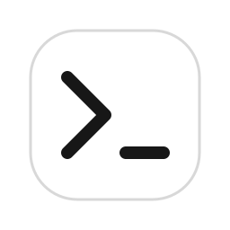

# Codex Action Ring



Ten selectable Codex desktop actions for the Logitech MX Master 4 for Mac Actions Ring.
Developed by **xianwei zhang**. Independent integration; not endorsed by OpenAI or Logitech.

## Install

Requires macOS, Codex desktop, Logi Options+ with plugin support, and MX Master 4 for Mac.

1. Download [CodexActionRing_0_1_10.lplug4](CodexActionRingPlugin/artifacts/CodexActionRing_0_1_10.lplug4) using GitHub’s download button and open it to install.
2. In Options+, select Codex Action Ring and choose any eight actions for the eight ring slots. The original eight remain the default layout; Select Model and Toggle Sidebar are additional choices.
3. Keep Codex frontmost and restore Codex's default keyboard shortcuts. Start Dictation needs a visible input box.

| Action | Delivery |
| --- | --- |
| Next Attention | Command–Option–A |
| View Activity | Command–Option–U |
| New Chat | Codex new-chat deep link |
| Quick Chat | Command–Option–N |
| Side Chat | Command–Option–S |
| Recently Viewed | Control–Tab |
| Copy Deep Link | Command–Option–L |
| Start Dictation | Control–Shift–D |
| Select Model | Control–Shift–M |
| Toggle Sidebar | Command–Shift–S |

Select Model opens Codex’s native model picker; choose the model there. Codex must be frontmost with a composer available. The shortcut follows the [official command reference](https://learn.chatgpt.com/docs/reference/commands).

Native feature availability depends on your Codex version. Options+ stores the top application icon separately as `Applications/<device>/@_codexactionring/ApplicationIcon.png`. Existing profiles can retain an older placeholder after a package update; refresh this file from the installed `metadata/Icon256x256.png` and restart Options+ and its plugin service, preserving the `Profiles` directory. When updating an existing ring, use Edit icon → Background Color → `767676` and Icon Color → `FFFFFF`, then Apply to multiple with only Background Color and Icon Color selected for the assigned Codex actions. Options+ stores this color in the profile and can override the packaged SVG color.
GitHub Releases are the distribution channel for this version.

## Build and test

Use the .NET 10 SDK and the PluginApi.dll installed by Logitech's plugin service. The SDK is referenced locally and is not bundled in this repository. Python 3 is used for packaging and validation; icon generation also requires librsvg (`rsvg-convert`) and Pillow.

```sh
dotnet build CodexActionRingPlugin/src/CodexActionRingPlugin.csproj -c Release
python3 -m unittest discover -s CodexActionRingPlugin/tests/Contracts -v
python3 -m unittest discover -s CodexActionRingPlugin/tests/IconSystem -v
```

Run each .NET test project under `CodexActionRingPlugin/tests/` with `dotnet test <project.csproj>`.
See [packaging](CodexActionRingPlugin/tools/package/README.md) and [validation](CodexActionRingPlugin/tools/validate/README.md) for the official LogiPluginTool workflow. Release versions are immutable; choose a new version when preparing a new package.

The current release uses a neutral-gray (`#767676`) Ring background with white glyphs (`#FFFFFF`), including the Toggle Sidebar action. Existing profiles may retain color overrides; use the migration instructions above.

Only the current installation package and verification report are kept in the checkout. Previous source and tracked packages remain recoverable from Git history. Local build and test output is ignored.

## Privacy and support

The plugin dispatches local shortcuts or a Codex deep link. It does not read prompts, clipboard links or audio and has no analytics or network client. Local diagnostic logs contain only version and anonymous error categories. Dictation is handled by Codex/ChatGPT under its own terms.

Report bugs through [GitHub Issues](https://github.com/semantic-craft/logi-codex/issues). Do not include private prompts, credentials or account details.

## License

Developer-owned code and CodexR assets are available under the [MIT License](LICENSE). Logitech SDK components and third-party trademarks retain their respective rights; no Logitech SDK binaries are included.
